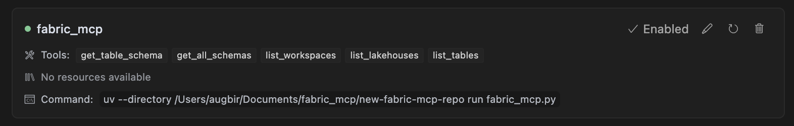
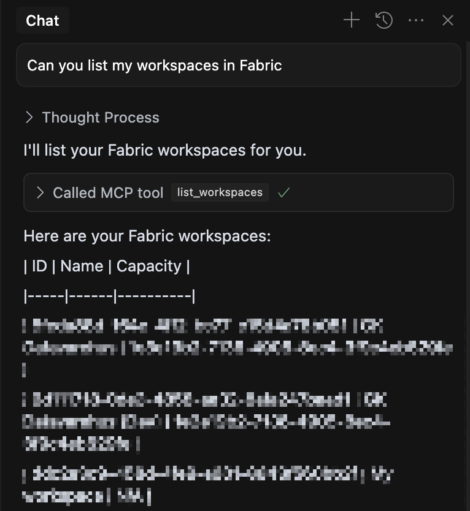

# Microsoft Fabric MCP

## Introduction

This MCP server is created to make it easier for data engineers working in Microsoft Fabric to use generative AI tools without requiring access to Microsoft Fabric Copilot (which demands F64-capacity), which can be prohibitively expensive for many organizations.

We have built MCP tools around the endpoints available in the Fabric REST API. Currently, we've focused on providing schema information for tables in lakehouses, but we plan to expand with more tools covering additional Fabric REST API endpoints as listed in the [Microsoft Fabric REST API documentation](https://learn.microsoft.com/en-us/rest/api/fabric/articles/) as well as the [Azure Data Lake Storage Gen2 REST API documentation](https://learn.microsoft.com/en-us/rest/api/storageservices/data-lake-storage-gen2)

By leveraging these tools, data engineers can enhance their productivity and gain AI assistance capabilities without the need for premium licensing.

## What is Model Context Protocol (MCP)?

The Model Context Protocol (MCP) is an open protocol that standardizes how applications provide context to Large Language Models (LLMs). Think of MCP like a standardized connection port for AI applications - it provides a standardized way to connect AI models to different data sources and tools.
x
### How MCP Works

MCP follows a client-server architecture:

- **MCP Hosts**: Programs like Cursor IDE, Windsurf, Claude CLI, or other AI tools that want to access data through MCP
- **MCP Clients**: Protocol clients that maintain connections with servers
- **MCP Servers**: Lightweight programs (like this Microsoft Fabric MCP) that expose specific capabilities through the standardized protocol
- **Data Sources**: Your Fabric resources, databases, and other services that MCP servers can securely access

This architecture allows LLMs to interact with your data and tools in a standardized way, making it possible to:

1. Connect to pre-built integrations that your LLM can directly use
2. Maintain flexibility to switch between LLM providers
3. Keep your data secure within your infrastructure

For this project, we recommend using Cursor as your IDE for the best experience, though Windsurf and Claude CLI are also compatible options.

## Getting Started

1. Clone this repository
2. Install required dependencies using UV (see "Setting Up UV Project" section below)
3. Set up Azure CLI authentication (see "Azure CLI Authentication" section below)
4. Use the tools as needed for your data engineering tasks

## Setting Up UV Project

After cloning this repository, follow these steps to set up the UV project:

1. Install UV (if not already installed):
```bash
# On macOS/Linux
curl -LsSf https://astral.sh/uv/install.sh | sh

# On Windows (using PowerShell)
powershell -ExecutionPolicy ByPass -c "irm https://astral.sh/uv/install.ps1 | iex"
```

2. Create a virtual environment:
```bash
uv venv
```

3. Activate the virtual environment:
```bash
# On macOS/Linux
source .venv/bin/activate

# On Windows
.venv\Scripts\activate
```

4. Install dependencies:
```bash
uv pip install -e .
```

5. Verify installation:
```bash
uv run fabric_mcp.py
```
This confirms that everything is working correctly.

## Azure CLI Authentication

This toolkit requires Azure CLI to be installed and properly configured for authentication with Microsoft Fabric services.

### Azure CLI Setup

1. Install Azure CLI (if not already installed):
```bash
# For macOS
brew install azure-cli

# For Windows
# Last ned installasjonen fra: https://aka.ms/installazurecliwindows
# Eller bruk winget:
winget install -e --id Microsoft.AzureCLI

# For other platforms, see the official Azure CLI documentation
```

2. Log in to Azure with CLI:
```bash
az login
```

3. Verify the login works:
```bash
az account show
```

4. If you have multiple subscriptions, select the one you want to use:
```bash
az account set --subscription "Name-or-ID-of-subscription"
```

When this is done, the `DefaultAzureCredential` in our code will automatically find and use your Azure CLI authentication.

## Setting up MCP

To use the MCP (Module Context Protocol) with this toolkit, follow these steps:

1. Make sure you have completed the UV setup and Azure CLI authentication steps above.

2. Add an MCP with a suitable name (like "fabric") in the Cursor settings under the MCP section. Use the following command format:
```bash
uv --directory PATH_TO_YOUR_FOLDER run fabric_mcp.py
```

For example:
```bash
uv --directory /Users/augbir/Documents/coding-assistant-tips/coding-assistant-tips/ run fabric_mcp.py
```

Replace `PATH_TO_YOUR_FOLDER` with the path to the folder containing this toolkit. This command configures the MCP server with the Fabric-specific tools.

3. Once the MCP is configured, you can interact with Microsoft Fabric resources directly from your tools and applications.

4. You can use the provided MCP tools to list workspaces, lakehouses, and tables, as well as extract schema information as documented in the tools section.

5. When successfully configured, your MCP will appear in Cursor settings like this:



## Windows Setup

### Setting up the MCP Command

On Windows, you can create a batch file to easily run the MCP command:

1. Create a file named `run_mcp.bat` with the following content:
   ```
   @echo off
   SET PATH=C:\Users\YourUsername\.local\bin;%PATH%
   cd C:\path\to\your\microsoft_fabric_mcp\
   C:\Users\YourUsername\.local\bin\uv.exe run fabric_mcp.py
   ```

   Example with real paths:
   ```
   @echo off
   SET PATH=C:\Users\YourUsername\.local\bin;%PATH%
   cd C:\Users\YourUsername\source\repos\microsoft_fabric_mcp\
   C:\Users\YourUsername\.local\bin\uv.exe run fabric_mcp.py
   ```

2. You can then run the MCP command by executing:
   ```
   cmd /c C:\path\to\your\microsoft_fabric_mcp\run_mcp.bat
   ```

   Example:
   ```
   cmd /c C:\Users\YourUsername\source\repos\microsoft_fabric_mcp\run_mcp.bat
   ```

### Virtual Environment Permissions

When activating the virtual environment using `.venv\Scripts\activate` on Windows, you might encounter permission issues. To resolve this, run the following command in PowerShell before activation:

```powershell
Set-ExecutionPolicy -ExecutionPolicy Bypass -Scope Process
```

This temporarily changes the execution policy for the current PowerShell session only, allowing scripts to run.

## Example Usage

Once you have set up the MCP server, you can start interacting with your Fabric resources through your AI assistant. Here's an example of how to use it:

### Listing Workspaces in Fabric

You can simply ask your AI assistant to list your workspaces in Fabric:

```
Can you list my workspaces in Fabric?
```

The LLM will automatically understand which MCP tool to use based on your query. It will invoke the `list_workspaces` tool and display the results:



### Advanced Use Cases

The main advantage of this MCP integration becomes clear when working with more complex tasks. For example, you can ask Claude to create a notebook that reads data from a specific table in one lakehouse and upserts it into another table in a silver lakehouse:

```
Can you create a notebook that reads data from the 'sales' table in the Bronze lakehouse and upserts it into the 'sales_processed' table in the Silver lakehouse? The notebook should take into consideration the schema of both tables.
```

In this scenario, Claude can use the MCP tools to:
1. Get the schema information for both tables
2. Understand the data structure and relationships
3. Generate appropriate code that handles data types correctly
4. Create an efficient upsert operation based on the actual table schemas

This level of context-aware assistance would be impossible without the MCP integration giving Claude access to your actual Fabric resources and schemas.

### Permission Handling

By default, the AI assistant will ask for your permission before running MCP tools that interact with your data. This gives you control over what actions are performed.

If you're using Cursor and want to enable faster interactions, you can enable YOLO mode in the settings. With YOLO mode enabled, the AI assistant will execute MCP tools without asking for permission each time.

> **Note**: YOLO mode is convenient but should be used with caution, as it grants the AI assistant more autonomous access to your data sources.

## Contributing

Feel free to contribute additional tools, utilities, or improvements to existing code. Please follow the existing code structure and include appropriate documentation.